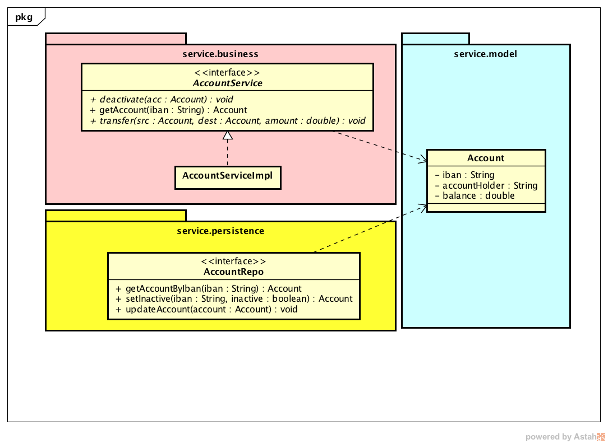

##  HvA ASV :: Assignment 2
This is an introductory exercise about unitary tests using a **Mock Framework**. 

## Prerequisites
You must have an IDE to work with this project. We recommend using the IntelliJ IDEA Community Edition. This IDE has good integration with Maven and JUnit.

https://www.jetbrains.com/idea/download/#section=mac

### Installation & Configuration

Download or clone this project and open it using your IDE

### Exercise

- You will create unitary tests for a service layer of a banking application (see diagram above)
- Use a mock framework create real unitary tests
- Use a code coverage tool to help you building your tests
- To follow instructions, see the TODO tab of your IDE, or look for TODO tags into the source-code
- Use [this link](http://www.vogella.com/tutorials/Mockito/article.html) as a usage guide of the Mockito framework: